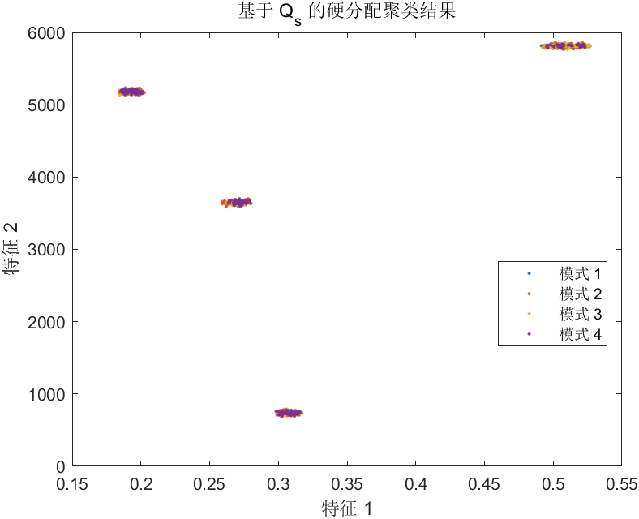
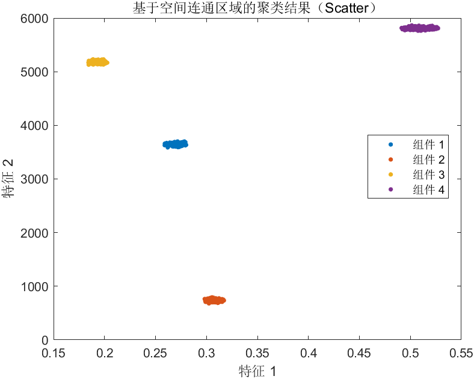
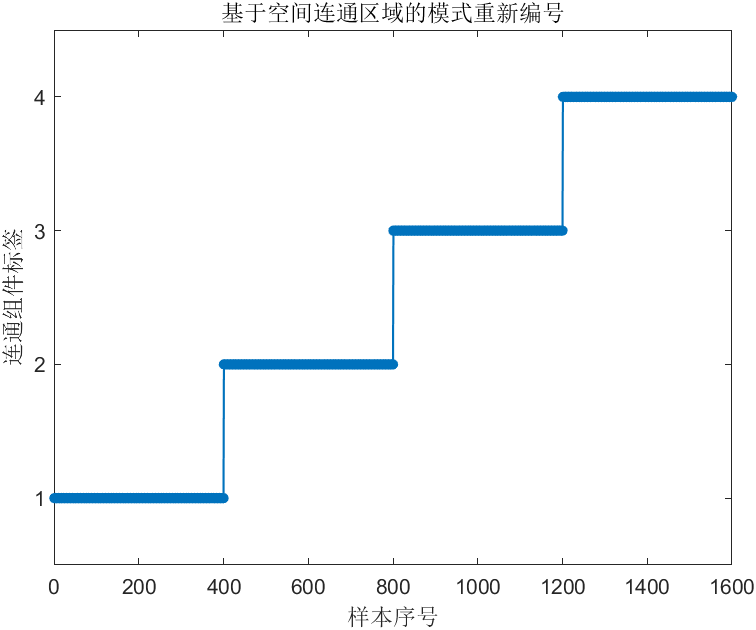
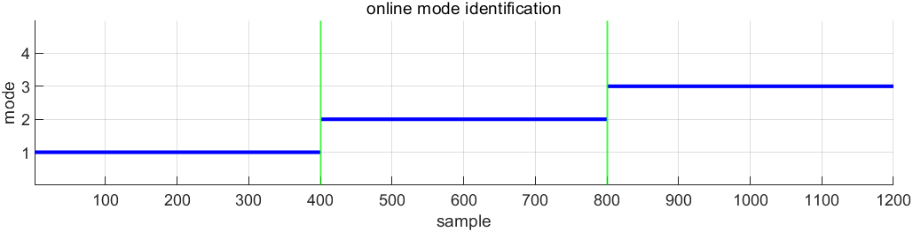
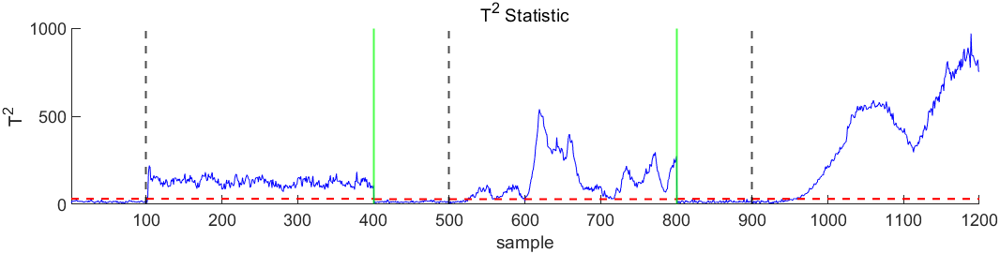
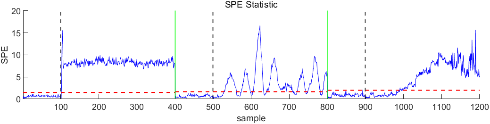

---
export_on_save:
    puppeteer: true # 保存文件时导出 PDF
    
---
# 模型建立

加入了Q矩阵，

$$
\min_{P,E,Z,Q}\sum_{s=1}^S\|Z_s\|_*+\sum_{s=1}^S\delta\|E_s\|_{2,1}+\sum_{s=1}^S\kappa\|P_sXQ_s-P_sXQ_sZ_s\|_F^2+\lambda \sum_{s \not ={t}}\text{HSIC}(Z_s,Z_t)\\
\text{s.t.}XQ_s=XQ_sZ_s+E_s,P_s^TP_s=I 
$$

其中：
$X=[X_1,X_2,\dots,X_S]\in \mathbb{R} ^{D\times N}$,是多模态数据，D为原始数据的特征数，N为所有模态数据的样本总数$ N=\sum^{S}n_s $
$X_s\in\mathbb{R} ^{D\times n_s}$,是每个模态的数据
$P_s\in\mathbb{R} ^{d\times D}$,d为降维之后特征数
$Q_s\in\mathbb{R} ^{N\times n_s}$, $n_s$为单个模态数据的样本数
$Z_s\in\mathbb{R} ^{n_s\times n_s}$
$E_s\in\mathbb{R} ^{D\times n_s}$

# 更新优化
## 1. J

## 2. Z
   
## 3. P
$$
\min_P \gamma\|PXQ-PXQZ\|_F^2
$$
## 4. Q
$$
\min_Q \gamma\|PXQ-PXQZ\|_F^2+\frac{\mu}{2}\left\lVert XQ-XQZ-E+\frac{\Lambda}{\mu}\right\rVert _F^2
$$
## 5. E

# 在线监控
得到每个模态的$P_s$

## 1. 训练样本的“硬分配”标签

给定分配矩阵集合 \(\{Q_s\}_{s=1}^S\)，其中
\[
Q_s \in \mathbb{R}^{N\times n_s},
\]
计算每个训练样本 \(i\) 对第 \(s\) 模态的响应度：
\[
W_{i,s} \;=\;\sum_{j=1}^{n_s} \bigl[Q_s\bigr]_{i,j}.
\]
把所有模式并列得到权重矩阵 \(W\in\mathbb{R}^{N\times S}\)，然后对每行取最大：
\[
\ell_i \;=\;\arg\max_{s=1,\dots,S} \,W_{i,s},
\]
得到训练样本的硬标签向量
\(\displaystyle \boldsymbol{\ell} = [\ell_1,\dots,\ell_N]^\top.\)

## 2. 基于空间连通性的重新编号

将训练样本在所选二维空间（此处取特征 1、2 维）视为点集合
\(\{\mathbf{x}_i\}_{i=1}^N\subset\mathbb{R}^2\)。  
1. 对每个点 \(i\) 找到其 \(K\) 个最近邻索引 \(\mathcal{N}(i)\)。  
2. 构造无向图邻接矩阵
\[
A_{ij} = \begin{cases}
1, & j\in\mathcal{N}(i)\text{ or }i\in\mathcal{N}(j),\\
0, & \text{otherwise},
\end{cases}
\]
3. 在图上求**连通分量**，令
\(\displaystyle c_i\in\{1,\dots,C\}\)
表示点 \(i\) 所在的第 \(c_i\) 个连通组件。

## 3. 测试样本的模式预测

对每个测试样本 \(\mathbf{y}_k\)：  
1. 在训练集上找到最邻近点索引  
   \[
     j^* = \arg\min_{1\le j\le N} \;\|\mathbf{y}_k - \mathbf{x}_j\|_2.
   \]
2. 继承该训练点的标签：
   \[
     \hat s_k = \ell_{j^*}.
   \]

## 4. 各模态均值与主成分协方差

令训练中归入模式 \(s\) 的样本集合为 \(\mathcal{I}_s\)，样本数 \(n_s=|\mathcal{I}_s|\)。  

1. **均值**  
   \[
     \boldsymbol\mu_s
     = \frac{1}{n_s}\sum_{i\in\mathcal{I}_s}\mathbf{x}_i.
   \]
2. **数据中心化**  
   \(\displaystyle X_s = [\mathbf{x}_i]_{i\in\mathcal{I}_s}
      \in\mathbb{R}^{D\times n_s},\quad
      \widetilde X_s = X_s - \boldsymbol\mu_s\mathbf{1}^\top.\)
3. **投影得分**  
   \(\displaystyle T_s = P_s\,\widetilde X_s\in\mathbb{R}^{d\times n_s}.\)
4. **投影协方差**  
   \[
     \Lambda_s
     = \frac{1}{\,n_s-1\,}\,T_s\,T_s^\top
     \in\mathbb{R}^{d\times d}.
   \]

---

## 5. T² 与 SPE 统计量

对任意（中心化后）样本 \(\mathbf{z}\in\mathbb R^D\) 属于模式 \(s\)：
1. **Hotelling T²**  
   \[
     t = P_s\,\mathbf{z},\quad
     T^2 = t^\top \Lambda_s^{-1} t.
   \]
2. **SPE（平方预测误差）**  
   \[
     E = \bigl(I - P_s^\top P_s\bigr)\mathbf{z},\quad
     \text{SPE} = E^\top E.
   \]

---

## 6. 控制限的核密度估计

用训练集所有 \(T^2\)（或 SPE）样本，做核密度估计求累积分布函数 \(F(x)\)，找到
\[
L_{\alpha} = \inf\{\,x: F(x)\ge 1-\alpha\},
\]
作为置信水平 \(1-\alpha\)（如 99%）的控制限。

## 7. FDR 与 FAR

设第 \(s\) 个模式下故障发生区间为 \([t_s^{\mathrm{fault}},\,t_s^{\mathrm{end}}]\)，
基线区间为 \([t_s^{\mathrm{start}},\,t_s^{\mathrm{fault}}-1]\)。则：

\[
\text{FDR}_s
= \frac{\displaystyle\#\{\,k: T^2_k \ge L_\alpha,\;k\in[t_s^{\mathrm{fault}},\,t_s^{\mathrm{end}}]\}}
       {\displaystyle t_s^{\mathrm{end}}-t_s^{\mathrm{fault}}+1},
\]
\[
\text{FAR}_s
= \frac{\displaystyle\#\{\,k: T^2_k > L_\alpha,\;k\in[t_s^{\mathrm{start}},\,t_s^{\mathrm{fault}}-1]\}}
       {\displaystyle t_s^{\mathrm{fault}}-t_s^{\mathrm{start}}}.
\]
同理对 SPE 统计量计算 \(\text{FDR}_{s}^{\mathrm{SPE}}\) 与 \(\text{FAR}_{s}^{\mathrm{SPE}}\)。

---

以上即对应你的整段 MATLAB 代码中各部分的数学表达式与计算流程。