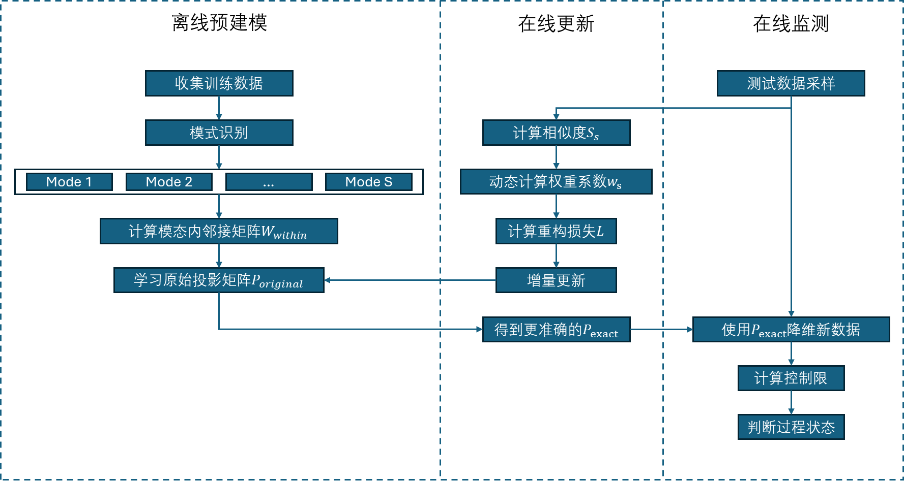

---
export_on_save:
    puppeteer: true # 保存文件时导出 PDF
    
---
# OCL_Draft
## 问题描述
目前为止多工况过程监测的模型都是建立在训练数据和测试数据都有相同的mode种类和数量\
解决的问题：训练数据中的所有模式都会共同影响投影矩阵P的学习，当测试数据的mode种类少于训练数据的mode种类时，比如：测试数据中只包含模式1（mode1）和模式2（mode2），但训练数据中有模式1（mode1）和模式2（mode2）模式3（mode3），在由训练数据学习出的位于$P$矩阵集合$P=[P_1;P_2;P_3]$中的$P_1$和$P_2$，在训练过程会受到模式3的影响。

## 离线建模
最终的联合目标函数为：
\(
\begin{aligned}
\min_{Z,E,P} \|Z\|_*+\alpha\sum _{s=1}^{S}\|E_s\|_{2,1}+\beta\sum_{s=1}^{S}\sum_{i,j=1}^{n}\|P_s^T\mathbf{x_i^s}-P_s^T\mathbf{x_j^s}\|^2W^{S}_{wit,ij}+\lambda\sum_{s=1}^{S}\|P_s^TX_s-P_s^TX_sZ\|_F^2 \\
\text{s.t.}  \quad X_s=X_sZ+E_s,
\end{aligned}
\)
转化为紧凑的形式：
\(
\begin{aligned}
\min_{Z, E, P} & \quad \|Z\|_* + \alpha \|E\|_{2,1} + \beta \cdot \text{Tr}\left(P^T X L X^T P\right) + \lambda \left\|P^T X (I - Z)\right\|_F^2 \\
\text{s.t.} & \quad X = X Z + E,
\end{aligned}
\)

其中，Z是多个模态的公共低秩结构，
- $E = [E_1; E_2; \ldots; E_S]$：垂直堆叠的误差矩阵（维度 \(S n \times d\)，假设每个 \(E_s \in \mathbb{R}^{n \times d}\)）。
- \(P = [P_1; P_2; \ldots; P_S]\)：垂直堆叠的投影矩阵（维度 \(S d \times k\)，假设每个 \(P_s \in \mathbb{R}^{d \times k}\)）。
- \(X = [X_1; X_2; \ldots; X_S]\)：垂直堆叠的多模态数据矩阵（维度 \(S n \times d\)，假设每个 \(X_s \in \mathbb{R}^{n \times d}\)）。
- \(L = \text{diag}(L_1, L_2, \ldots, L_S)\)：块对角图拉普拉斯矩阵（维度 \(S n \times S n\)），其中 \(L_s = D_s - W_s\) 为第 \(s\) 个模态的图拉普拉斯矩阵。

## 优化更新
引入辅助变量$J$ 分解核范数项
\(
\begin{aligned}
\min_{Z, E, P,J} & \quad \|J\|_* + \alpha \|E\|_{2,1} + \beta \cdot \text{Tr}\left(P^T X L X^T P\right) + \lambda \left\|P^T X (I - Z)\right\|_F^2 \\
\text{s.t.} & \quad X = X Z + E,Z=J
\end{aligned}
\)
构建增广拉格朗日函数
以下是针对目标函数的增广拉格朗日函数构建过程：
### **增广拉格朗日函数**
考虑原问题的约束条件 \(X = XZ + E\) 和 \(Z = J\)，引入拉格朗日乘子 \(\Gamma\) 和 \(\Lambda\)，并添加二次惩罚项，得到增广拉格朗日函数：

\[
\begin{aligned}
\mathcal{L}(Z, E, P, J, \Gamma, \Lambda) &= \|J\|_* + \alpha \|E\|_{2,1} + \beta \cdot \text{Tr}\left(P^\top X L X^\top P\right) + \lambda \left\|P^\top X (I - Z)\right\|_F^2 \\
&\quad + \underbrace{\left\langle \Gamma, X - XZ - E \right\rangle + \frac{\mu}{2} \|X - XZ - E\|_F^2}_{\text{约束 } X = XZ + E} \\
&\quad + \underbrace{\left\langle \Lambda, Z - J \right\rangle + \frac{\rho}{2} \|Z - J\|_F^2}_{\text{约束 } Z = J},
\end{aligned}
\]

其中：
- \(\Gamma\) 和 \(\Lambda\) 是拉格朗日乘子矩阵，维度分别与 \(X\) 和 \(Z\) 相同。
- \(\mu, \rho > 0\) 是惩罚参数，控制约束违反的惩罚强度。
- \(\left\langle A, B \right\rangle = \text{Tr}(A^\top B)\) 表示矩阵内积。

### **紧凑形式**
为简化表达，可将线性项与二次项合并为完整平方式：

\[
\begin{aligned}
\mathcal{L}(Z, E, P, J, \Gamma, \Lambda) &= \|J\|_* + \alpha \|E\|_{2,1} + \beta \cdot \text{Tr}\left(P^\top X L X^\top P\right) + \lambda \left\|P^\top X (I - Z)\right\|_F^2 \\
&\quad + \frac{\mu}{2} \left\|X - XZ - E + \frac{\Gamma}{\mu}\right\|_F^2 \\
&\quad + \frac{\rho}{2} \left\|Z - J + \frac{\Lambda}{\rho}\right\|_F^2 \\
&\quad - \frac{1}{2\mu} \|\Gamma\|_F^2 - \frac{1}{2\rho} \|\Lambda\|_F^2.
\end{aligned}
\]
### 变量更新

### **关键项说明**
1. **核范数项**：\(\|J\|_*\) 约束辅助变量 \(J\) 的低秩性。
2. **误差稀疏项**：\(\alpha \|E\|_{2,1}\) 强制误差矩阵 \(E\) 行稀疏。
3. **图正则化项**：\(\beta \cdot \text{Tr}(P^\top X L X^\top P)\) 保留多模态数据的局部流形结构。
4. **投影一致性项**：\(\lambda \|P^\top X (I - Z)\|_F^2\) 对齐投影后的数据与低秩表示。
5. **约束惩罚项**：
   - \(\frac{\mu}{2} \|X - XZ - E + \Gamma/\mu\|_F^2\) 强制数据重构误差符合 \(X = XZ + E\)。
   - \(\frac{\rho}{2} \|Z - J + \Lambda/\rho\|_F^2\) 确保 \(Z\) 与辅助变量 \(J\) 一致。

## 加入自适应重构损失项--在线更新（学习）机制
加入自适应重构损失项，并且在原来的离线建模和在线监控过程中间加入在线学习过程，在线学习过程根据自适应重构损失项来选择并调整当前测试数据所对应mode的$P_{mode}$,调整过程是增量更新过程。\
自适应重构损失项的具体形式$f(\cdot)$待定
$$
\mathcal{L}_{\text{recon}}^{\text{adaptive}}=f(P_s,w_s,..)
$$
$$
\mathcal{L}_{\text{recon}}^{\text{adaptive}}=\sum^S_{s=1} w_s\|f(P_s,w_s,...)\|
$$
## 引入动态权重 $w_s$ 对每个模式的重构误差进行加权 

这样，对于测试数据中未出现的模式，其对应的 $w_s$ 将被动态降低（甚至趋于零），使得这些模式对整体重构误差的贡献减弱。

$w_s$的设计：\
**对于每个模式s，可以预先计算该模式的代表性向量$\mu_s$**，$\mu_s$可以是训练数据中每个模式的均值或者聚类中心。\
采用点积或者余弦相似度
$$
s_s=f(\mathbf{x_{new}},\mu_s)
$$
可以在 softmax 前加入一个门限 $\tau$：
$$
w_s = 
\begin{cases}
\frac{\exp(\lambda s_s)}{\sum_{s=1}^{S} \exp(\lambda s_s)}, & \text{if } 
s_s \ge \tau \\
0, & \text{if } s_s < \tau
\end{cases}
$$
这样，当相似度低于阈值时，模式 $s$ 的权重 $w_s$ 将为零，从而忽略该模式对重构损失的贡献。
## **在线学习增量更新模型参数**
1. **增量更新**：  
通过在线学习算法对模型参数进行更新。在线学习意味着在每次获得新数据后，不是重新训练整个模型，而是通过增量更新已有模型：
- 对于每个模式 $s$，更新投影矩阵 $P_s$ ，通过梯度下降或其他优化方法：
     $$
     P_{s,excat} \leftarrow P_{s,original} - \eta \frac{\partial \mathcal{L}_{\text{recon}}^{\text{adaptive}}}{\partial P_s}
     $$
     其中，$\eta$ 是学习率，$\frac{\partial \mathcal{L}_{\text{recon}}^{\text{adaptive}}}{\partial P_s}$ 是重构损失对$P_s$ 的梯度。第一次迭代使用$P_{s,original}$。每得到一个$\mathbf{x_{new}}$，都只增量更新一次。

1. **更新其他模型参数 ???**：  
   除了投影矩阵 $P_s$，可能还需要根据目标函数的其他部分更新模型的其它参数

